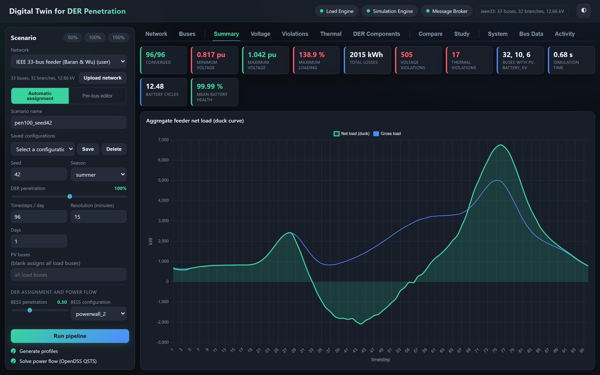
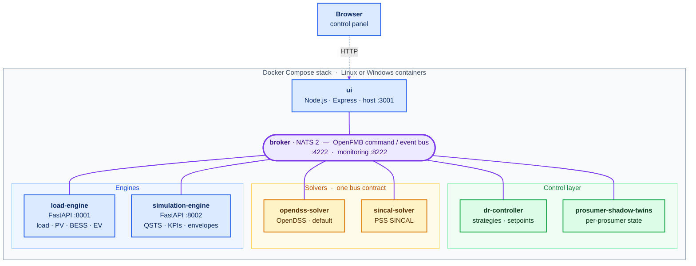
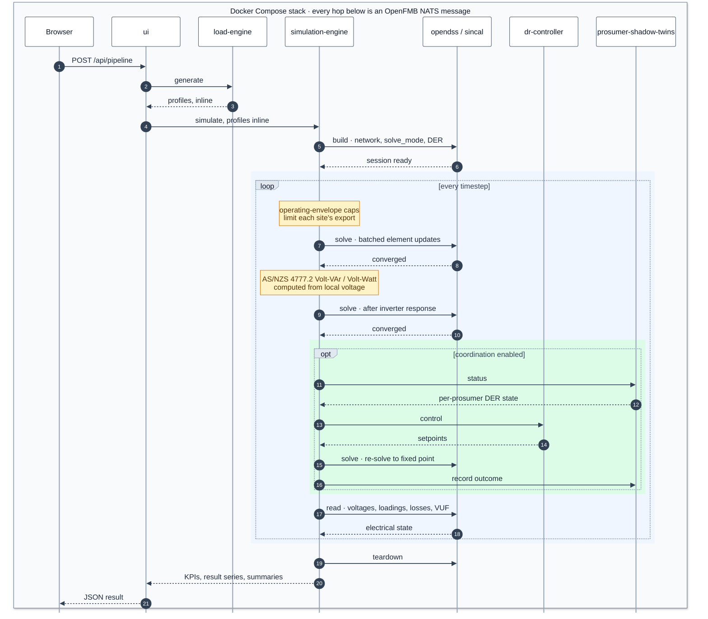

<div align="center">

# Containerised Digital Twin Platform for Evaluating Network Impacts of DER Integration

**Solver-agnostic QSTS power flow, Australian DER regulatory modelling, seven containers on one message bus**

[](LICENSE)
[](#verification)
[](#)
[](WINDOWS.md)
[](#modularity-the-registries)

</div>

This platform generates per-bus load, PV, battery (BESS) and EV profiles for any
uploaded distribution network, solves single- or multi-day quasi-static
time-series (QSTS) power flow on single- or multi-voltage (MV/LV) feeders,
coordinates demand-response control across per-prosumer shadow twins, models the
Australian regulatory mechanisms that govern DER export (AS/NZS 4777.2 inverter
responses, CSIP-Aus dynamic operating envelopes), and presents all of it through
a browser control panel.

It is built as seven containers on an OpenFMB/NATS message bus, developed as a
final-year engineering project at Swinburne University of Technology.

<!-- Add a control-panel screenshot here once captured, it is the single
     highest-impact addition to this page:
     
-->

## What makes it different

- **The power-flow engine is swappable.** Solvers are standalone containers
  behind one bus contract (`build` / `solve` / `read` / `reset` / `teardown`).
  OpenDSS is the default; a PSS SINCAL adapter implements the same contract.
  The orchestrator holds no solver code at all.
- **Every capability is a registry, not an engine edit.** DER types, load
  archetypes, weather providers, network importers, solvers, KPIs, tariffs, DR
  strategies, control devices and envelope-allocation policies are all plug-ins.
  A new DER type end to end is three small plugins and zero engine changes.
- **It ships no built-in networks.** Every feeder is user-supplied through
  JSON, PSS/E RAW/RAWX, CIM/CGMES or an OpenDSS `.dss` master file, so the same
  code models any network rather than a bundled example.
- **Results carry their own audit.** Every timestep records its convergence
  flag, summary statistics use converged steps only, and an
  `energy_balance_error_pct` KPI checks source power against expected net load
  plus losses on every run.

## Quick start

Requires Docker Desktop and free ports `3001`, `4222`, `8222`, `8001`, `8002`.

```bash
docker compose up --build
```

Then open **http://localhost:3001**, upload a network model, choose your
scenario controls and run the pipeline. For the full Windows-container
deployment, which is the only mode where PSS SINCAL runs as a compose service,
see [WINDOWS.md](WINDOWS.md) and the [Run](#run) section.

## Contents

- [Architecture](#architecture)
- [Run](#run)
- [Load Engine (profile generation)](#load-engine-profile-generation)
- [Simulation Engine (power flow and analysis)](#simulation-engine-power-flow-and-analysis)
- [Demand-response coordination](#demand-response-coordination)
- [Control panel (UI)](#control-panel-ui)
- [Modularity: the registries](#modularity-the-registries)
- [Network model format](#network-model-format)
- [Configuration](#configuration-core-environment-variables)
- [Verification](#verification)
- [Repository layout](#repository-layout)
- [Standards and data sources](#standards-and-data-sources)
- [Licence](#licence)
- [Citation](#citation)

---

## Architecture

### Deployment topology

Every service is a container and a first-class bus participant. The browser
talking to the UI server is the only HTTP in the stack.



No inter-container HTTP and no shared profile or result volume: profiles, QSTS
summaries, KPIs and chart series all travel inline in NATS messages. Topics
follow `{prefix}/command/{service}/{action}` and
`{prefix}/event/{service}/{action}` with correlation ids. The engine HTTP ports
(8001, 8002) are published for host-side debugging only.

### How one study runs



Operating-envelope caps limit each site's export *before* the solve; the
autonomous AS/NZS 4777.2 Volt-VAr and Volt-Watt responses need the local
voltage, so they are computed *after* it and the network re-solves. Both are
the Simulation Engine's work and both precede the DR exchange. Solvers stay
dumb: no control logic, no optimisation policy.

| Service | Technology | Role |
|---------|------------|------|
| `broker/` | NATS 2 | OpenFMB command/event message bus (4222; monitoring 8222) |
| `load-engine/` | FastAPI (Python) | Load, PV, BESS, and EV profile generation |
| `simulation-engine/` | FastAPI (Python) | Solver-agnostic QSTS orchestration, KPIs, envelopes, DR |
| `opendss-solver/` | NATS module (Python) | OpenDSS power flow behind the solver bus contract (default solver) |
| `sincal-solver/` | NATS module (Python) | PSS SINCAL adapter — same contract; a first-class service under the Windows deployment, host-run under the Linux one |
| `dr-controller/` | NATS module (Python) | DR strategies and DER control setpoints |
| `prosumer-shadow-twins/` | NATS module (Python) | Per-prosumer twin state and outcomes |
| `ui/` | Node.js / Express | Control panel and study runner |
| `tools/` | Offline scripts | Plot/report generation (not required at runtime) |

**All containers interconnect over the OpenFMB NATS bus only.** The single
exception is the browser talking to the UI server. There is no inter-container
HTTP and no shared profile/result volume — profiles, QSTS summaries, KPIs, and
chart series travel inline in NATS messages. Topics follow
`{prefix}/command/{service}/{action}` → `{prefix}/event/{service}/{action}`
with correlation ids; engine HTTP ports (8001/8002) are published for
host-side debugging only.

---

## Run

The stack ships **two complete deployment modes**. Docker Desktop runs either
Linux or Windows containers, never both at once, so they are alternatives.

**Linux containers (default).** Requirements: Docker Desktop (Linux engine)
and free ports `3001`, `4222`, `8222`, `8001`, `8002`.

```bash
docker compose up --build
```

**Windows containers (v5.0, SINCAL-capable).** Every service — including the
PSS SINCAL solver — runs as a Windows container in one compose stack.
Requires Windows 11 Pro or better with Docker Desktop switched to Windows
containers:

```bash
docker compose -f docker-compose.windows.yml up --build
```

Full guide, base-image choices, footprint, and the SINCAL setup:
**[WINDOWS.md](WINDOWS.md)**.

Open **http://localhost:3001** (the host port is 3001 because 3000 commonly
hosts another local app; the container-internal port remains 3000). Upload a
network model (the registry starts empty), pick your scenario controls, and
run the pipeline.

Local development: each engine runs standalone with `uvicorn app.main:app`
and the UI with `npm start`, given a broker. Under the Linux compose, UI
static assets and `server.js` are bind-mounted — a browser refresh picks up
static changes and `docker compose restart ui` reloads the server. (Windows
containers cannot bind-mount single files, so there `server.js` changes need
an image rebuild; `ui/public` stays live.)

---

## Load Engine (profile generation)

- **Archetypes** — 9 Australian customer classes: six residential classes
  covering Australian housing stock, plus three commercial classes for the
  buildings found on an urban feeder or university campus (small office,
  medium office, and a tertiary-education teaching building with evening
  classes). Occupancy-driven with season design-day HVAC and distinct
  weekday/weekend behaviour.
- **Load diversity** — buses aggregate many households (base load ÷ ADMD,
  default 1.5 kW measured Australian diversified ADMD) with staggered peaks;
  coincidence factors below 1 emerge naturally. EV arrival diversity smears
  fleet charging across a realistic evening window.
- **PV** — season-aware clear-sky curve (sunrise equation), ~0.80
  performance ratio, persistent AR(1) cloud attenuation, and cell-temperature
  derating (−0.4%/°C). When the weather source supplies irradiance, the
  **measured sky drives PV directly**, replacing the synthetic clouds.
- **BESS** — named Australian battery configs (Powerwall 2/3, BYD HVS,
  Enphase 5P, generics, an asymmetric 3.3/6.6 kW hybrid), separate
  charge/discharge limits, self-consumption or time-of-use dispatch windows,
  true round-trip efficiency, and **state-of-health ageing** (cycle +
  calendar fade; ~80% SoH near 4000 cycles) carried across days.
- **EV** — fleet-scaled: an EV bus carries its whole household fleet, with
  session energies calibrated to ACN-Data (~8–12 kWh evening top-up) and
  uncontrolled / off-peak / smart charging strategies.
- **Weather** — drives **PV generation only** (cell-temperature derating and
  measured-sky irradiance; load shapes keep their fixed season curves).
  Three fully offline sources: `none`, `synthetic`, and `file` (local CSV of
  hourly `temp_C[,ghi_Wm2]` rows — measured data, reproducible runs).
  Provider failures degrade to synthetic; irradiance is best-effort.
- **Multi-day horizons** — up to 31 days with weekday/weekend calendar
  awareness, per-day weather, and battery SOC/SoH continuity.
- **Custom profiles** — kind-aware CSV uploads: `load` shapes become customer
  classes (`custom:<name>`), `pv` shapes are measured PV days selected
  scenario-wide, `ev` shapes are per-charger days scaled by rating and fleet.
- **Calibration** — defaults are nationally representative for Australia
  (DNSP/AER/AEMO/APVI data); regional tuning is done with request knobs
  (ADMD, season, configs), never code changes.

## Simulation Engine (power flow and analysis)

- **Pluggable solver containers** — the engine itself contains no solver
  code. It opens a session with the selected solver container over the
  **solver bus contract** (`build`/`solve`/`read`/`reset`/`teardown` NATS
  commands), streams batched element updates each timestep, and reads back
  the electrical state. `solver: "opendss"` (default) targets
  `opendss-solver/`; `"sincal"` targets the PSS SINCAL adapter;
  `register_solver()` adds more. Control logic (inverter responses,
  envelopes, DR) stays solver-side-free, so every backend is dumb and
  swappable.
- **OpenDSS QSTS** (the default solver) via OpenDSSDirect.py; the full
  multi-phase circuit model in both modes (`balanced` = symmetric
  three-phase, `unbalanced` = per-bus declared phases with single-phase EV
  chargers spread across phases). Positive-sequence mode is deliberately
  avoided (it triples 3-phase kW).
- **Multi-voltage feeders** — per-bus `base_kv`; branches flagged
  `is_transformer` become two-winding Transformer elements with correct
  per-unit bases. Transformers support **vector groups** (`wye_wye` default,
  `delta_wye`/Dyn11-style), **fixed off-load taps** (0.8–1.2 pu), and
  **OLTC** (`"oltc": true` → RegControl holding the secondary at 1.0 pu ± 2%).
  Transformer loading is measured as winding power vs kVA rating.
- **Zero sequence** — lines accept explicit `r0_ohm`/`x0_ohm` (default 3× the
  positive-sequence values) for realistic unbalanced solves.
- **Importers** — native JSON, PSS/E RAW (incl. v34+/v36 dialects), PSS/E
  RAWX, CIM/CGMES XML, and an **OpenDSS `.dss` master-file subset** (Circuit,
  Line, Load, 2-winding Transformer) — so IEEE test feeders and utility
  models load directly. Formats are a registry; unsupported statements are
  skipped with a logged count, never silently.
- **Autonomous inverter responses (AS/NZS 4777.2)** — Volt-VAr
  (reactive-power mode) and Volt-Watt (real-power backstop: 1.09 pu knee to a
  20% floor at 1.10 pu), run as a per-timestep fixed point. Precedence with
  DR is defined: envelope cap → autonomous Volt-Watt → commanded DR
  curtailment, so no layer silently undoes another.
- **Dynamic operating envelopes (DOEs)** — the Australian export-limit
  mechanism (SAPN Flexible Exports, CSIP-Aus `opModExpLimW`): `static` fixed
  per-site caps or `dynamic` per-site/per-interval limits computed from
  network headroom on the no-export forecast, by exact binary **search** or
  **sensitivity** linearisation with registered allocation policies
  (`equal`, `prorata`, `max_total` via LP/greedy). Enforcement is
  **autonomous** (the QSTS loop holds site export — battery discharge yields
  first, PV curtails the rest) or **managed** through the DR loop (the
  coordinator publishes `exportLimit_kW`; the controller's envelope plugin
  stores excess then curtails). Outputs: curtailed energy, envelope
  utilisation, and per-interval envelope/export chart series.
- **Convergence discipline** — every step is recorded with its convergence
  flag; summary statistics and KPIs use converged steps only.

### KPI registry (18 built-ins)

Voltage: `max_voltage_pu`, `min_voltage_pu`, `voltage_violations`,
`voltage_violation_rate`, `max_vuf_pct` (negative/positive-sequence unbalance).
Thermal: `max_thermal_loading_pct`, `thermal_violations`,
`max_transformer_loading_pct`, `transformer_loss_of_life_pct`
(IEC 60076-7-style hot-spot ageing).
Energy: `total_losses_kwh`, `reverse_power_hours`, `emissions_kg_co2e`.
Cost (priced by the named tariff): `energy_cost_aud`, `export_revenue_aud`,
`net_energy_cost_aud`.
Envelopes: `doe_curtailed_kwh`, `doe_envelope_utilisation_pct`.
Self-check: `energy_balance_error_pct` (source power vs expected net + losses
— near 0% on healthy uncoordinated runs) and `converged_fraction`.

### Tariff registry

Named import/export price structures for the cost KPIs: built-ins
`tou_residential` (peak window, env-configurable) and `flat`; the simulate
request selects one by name and `register_tariff()` adds more.

## Demand-response coordination

When a coordination mode is selected, the Simulation Engine owns the OpenDSS
solve and exchanges NATS messages each timestep: twins publish per-prosumer
DER status (voltage, PV/EV power, SOC, capacities, site demand, plus any extra
DER series), the DR controller returns setpoints, the coordinator applies them
and re-solves to a fixed point, and the final outcome is recorded back to the
twins.

**Strategies** (registry): `dr_only` (Volt-Watt curtailment + EV deferral),
`dr_p2p` (battery absorption before curtailment), `pv_curtail_only`.

**Control plugins** (ordered registry — one per controllable device):

| Plugin | Order | Action |
|--------|-------|--------|
| `bess` | 10 | Absorb excess PV into the battery (`dr_p2p`) |
| `bess_support` | 12 | Discharge the battery on under-voltage (peak support) |
| `pv` | 20 | Volt-Watt curtailment of remaining over-voltage |
| `pv_reactive` | 22 | Commanded VAr dispatch (inject low / absorb high, ≤44% of rating) |
| `envelope` | 25 | Hold site export at the published operating-envelope limit |
| `ev` | 30 | Defer EV charging on under-voltage |

**Prosumer shadow twins** are configurable (selection thresholds per session
or environment) and record curtailed PV, deferred EV, stored PV, battery
support energy, and outcomes for any custom DER — all summarised back into
the simulation response.

## Control panel (UI)

- Network management: upload/import (JSON, RAW/RAWX, CIM, `.dss`), interactive
  topology map with voltage-level colouring, transformer markers, and per-bus
  tooltips.
- Scenario controls for everything above, plus **saved scenario
  configurations** (browser-side, reload a full control set by name).
- Studies: **penetration sweep**, **hosting capacity** (KPI-thresholded),
  **locational hosting capacity** (per-bus, painted onto the topology map
  red→green by headroom), and **Monte Carlo** seeds.
- Results: summary metric cards (including battery ageing, DR outcomes,
  envelope curtailment/utilisation), duck curve and DER-mix charts with
  multi-day separators, per-day energy table, envelope-vs-export band,
  voltage envelope/heatmap/profile views, thermal views, comparisons, CSV
  export, and a live modular-registry (System) view.

---

## Modularity: the registries

| Registry | Where | Built-ins | Add one by |
|----------|-------|-----------|------------|
| DER generation plugins | load-engine `profiles/der_plugins.py` | load, pv, ev, bess | `register(DERPlugin())` |
| Load archetypes | load-engine `profiles/archetypes.py` | 9 classes | `register_archetype(...)` |
| Weather providers | load-engine `profiles/weather.py` | synthetic, file | `register_provider(...)` |
| Custom profile store | load-engine `profiles/custom.py` | kinds: load, pv, ev | CSV upload |
| Network importers | sim-engine `network/importers.py` | json, raw, rawx, cim, dss | `register_format(...)` |
| Power-flow solvers | sim-engine `solvers/registry.py` | opendss, sincal (each its own container) | `register_solver(...)` |
| DER elements (orchestration) | sim-engine `simulation/der_elements.py` | pv, bess, ev | `register(DERElement())` |
| DER element builders (OpenDSS) | opendss-solver `dss_solver/elements.py` | load, pv, pv_q, bess, ev | `register(ElementType())` |
| KPIs | sim-engine `metrics/kpi_registry.py` | 18 | `register(name, fn)` |
| Tariffs | sim-engine `metrics/tariffs.py` | tou_residential, flat | `register_tariff(...)` |
| Envelope allocations | sim-engine `control/envelopes.py` | equal, prorata, max_total | `register_allocation(...)` |
| DR strategies | dr-controller `strategy_registry.py` | dr_only, dr_p2p, pv_curtail_only | `register(name, factory)` |
| Control plugins | dr-controller `control_plugins.py` | 6 (table above) | `register(ControlPlugin())` |

**Drop-in loading without rebuilds**: the Load Engine imports
`DER_PLUGIN_MODULES` (comma-separated modules) and every `*.py` in
`DER_PLUGINS_DIR` at startup — each file just calls the relevant
`register()`. Import errors are logged and skipped, never fatal.

A new physical DER end to end is three small plugins (generation → element →
control); anything a generation plugin contributes beyond the built-ins
automatically reaches the power flow (via `other_der_kw`), the twins (as an
extra reading), and the charts — with zero engine edits.

A new **power-flow engine** is one new container implementing the six-command
solver bus contract plus a one-line `register_solver()` — the Simulation
Engine, control layers, KPIs, and UI are untouched (that is how the PSS
SINCAL adapter was added).

---

## Network model format

```json
{
  "id": "my_feeder",
  "name": "My feeder",
  "base_voltage_kv": 11.0,
  "source_bus": 1,
  "buses": [
    { "bus_id": 1, "base_load_kw": 0.0, "base_load_kvar": 0.0 },
    { "bus_id": 2, "base_load_kw": 150.0, "base_load_kvar": 60.0, "phases": "a" },
    { "bus_id": 3, "base_load_kw": 40.0, "base_load_kvar": 15.0, "base_kv": 0.4 }
  ],
  "branches": [
    { "branch_id": 1, "from_bus": 1, "to_bus": 2,
      "r_ohm": 0.30, "x_ohm": 0.15, "r0_ohm": 0.90, "x0_ohm": 0.45, "rating_kva": 3000 },
    { "branch_id": 2, "from_bus": 2, "to_bus": 3, "is_transformer": true,
      "connection": "delta_wye", "tap": 1.025, "oltc": true,
      "r_ohm": 2.4, "x_ohm": 10.9, "rating_kva": 500 }
  ]
}
```

Validated on upload: unique ids, real endpoints, connectivity from the source,
positive bases/ratings, phases spelling, lines forbidden across voltage
levels, transformer-only fields (`oltc`, `connection`, `tap`) rejected on
lines. All optional fields default sensibly (three-phase, Z0 = 3×Z1,
`base_kv` = network base, wye-wye, tap 1.0).

---

## Configuration (core environment variables)

| Variable | Service | Default | Purpose |
|----------|---------|---------|---------|
| `NATS_URL` / `BUS_PREFIX` / `BUS_TRANSPORT` | all | `nats://localhost:4222` / `openfmb` / `nats` | Bus wiring (`loopback` for tests) |
| `CUSTOM_PROFILES_DIR` | load | `outputs/custom_profiles` | Uploaded custom shapes |
| `WEATHER_FILE` | load | — | CSV for the `file` weather source |
| `DER_PLUGIN_MODULES` / `DER_PLUGINS_DIR` | load | — | Drop-in extension loading |
| `NETWORKS_DIR` | sim | `outputs/networks` | Network model registry directory |
| `DSS_DIR` | opendss-solver | `dss_work` | Per-session OpenDSS working directories |
| `VOLTAGE_LOWER_PU` / `VOLTAGE_UPPER_PU` / `THERMAL_LIMIT_PCT` | sim, dr | `0.95` / `1.05` / `100` | Violation and droop limits |
| `TARIFF_*`, `FLAT_RATE` | sim | AU TOU defaults | Built-in tariff rates |
| `TRANSFORMER_AMBIENT_C` | sim | `25.0` | Transformer ageing KPI ambient |
| `EMISSIONS_KG_PER_KWH` | sim | `0.60` | Grid emissions intensity |
| `MIN_PV_KW` / `MIN_BESS_KWH` / `MIN_EV_KW` / `INCLUDE_EV_ONLY` | twins | 0 / 0 / 0 / true | Twin selection thresholds |

Full per-service tables live in each service's README.

---

## Verification

- **332 automated tests** across the six Python services (load-engine 191,
  simulation-engine 88, opendss-solver 22, sincal-solver 5, dr-controller 15,
  prosumer-shadow-twins 11), including real-OpenDSS physics tests
  (multi-voltage solves, OLTC regulation, tap boosts, Volt-VAr/Volt-Watt
  voltage reduction, VUF on unbalanced solves, envelope enforcement). The
  Simulation Engine suite runs the real opendss-solver service in-process on
  the loopback bus, so the solver contract itself is exercised end to end.
- **Self-checking model**: the `energy_balance_error_pct` KPI audits source
  power against the expected net load plus losses every run (≈0% when
  healthy).
- Run everything locally: `python -m pytest -q` in each service directory.

Scope notes (honest limits): quasi-static only (no dynamics, faults, or
protection); three-wire model (no explicit neutral); control messaging is
ideal within a timestep; profiles are calibrated-synthetic unless measured
data is supplied via the CSV/weather-file paths.

---

## Repository layout

```text
broker/                  NATS configuration
load-engine/             FastAPI profile generation service (+ tests)
simulation-engine/       FastAPI solver-agnostic QSTS/KPI service (+ tests)
opendss-solver/          OpenDSS power-flow container — solver bus contract (+ tests)
sincal-solver/           PSS SINCAL adapter — same contract, needs licensed SINCAL (+ tests)
dr-controller/           NATS DR strategy/control service (+ tests)
prosumer-shadow-twins/   NATS twin-state service (+ tests)
ui/                      Express server + browser app (bind-mounted at runtime)
sample-networks/         User network models and tooling (e.g. the Swinburne
                         Hawthorn feeder in PSS/E RAW and CIM form, with
                         single-line-diagram generators)
outputs/                 UI-persisted summaries (bind-mounted)
tools/                   Offline plotting / report scripts
docker-compose.yml         Runs the whole stack (Linux containers)
docker-compose.windows.yml Runs the whole stack incl. SINCAL (Windows containers)
WINDOWS.md                 Windows-container deployment guide
```

## Standards and data sources

AS/NZS 4777.2 (Volt-VAr, Volt-Watt, reactive capability) · CSIP-Aus /
IEEE 2030.5 concepts (dynamic operating envelopes, `opModExpLimW`) ·
IEC 60076-7 (transformer hot-spot ageing) · IEC 61970/CGMES (CIM imports) ·
PSS/E RAW/RAWX formats · EPRI OpenDSS / OpenDSSDirect.py · OpenFMB (UCAIug)
messaging patterns over NATS ·
ACN-Data EV charging sessions · Australian DNSP/AER/AEMO/APVI calibration
data · IEEE 33-bus (Baran & Wu) test feeder in the test suites.

---

## Project status

Active final-year engineering project. The stack runs end to end and its four
Python services are covered by 332 automated tests, but it is research and
teaching software rather than an operational utility tool. Read the scope notes
under [Verification](#verification) before drawing conclusions from a study, and
note in particular that this is a **quasi-static, phasor-domain** model: no
electromagnetic transients, no dynamic stability, no protection operation.

Issues and questions are welcome. If you are extending it, the registry tables
under [Modularity](#modularity-the-registries) are the intended entry points.

## Licence

Licensed under the Apache License, Version 2.0. See [LICENSE](LICENSE) and
[NOTICE](NOTICE).

Two boundaries worth stating plainly:

- **PSS SINCAL is proprietary Siemens software and is not included.** The
  `sincal-solver/` service is an adapter only; running it requires a separately
  licensed PSS SINCAL installation on the machine that hosts it.
- **The EMS design lineage is OpenEMS** (<https://openems.io>, EPL-2.0). Its
  architecture and terminology are reproduced; none of its source code is
  included.

Third-party dependencies are permissive: OpenDSSDirect.py, numpy, scipy, uvicorn
and httpx (BSD-3-Clause), FastAPI, pydantic, pytest and Express (MIT), nats-py
and NATS Server (Apache-2.0).

## Citation

If you use Containerised Digital Twin Platform for Evaluating Network Impacts of DER Integration in academic work, please cite it:

```bibtex
@software{dtstack,
  author  = {YOUR FULL NAME},
  title   = {Containerised Digital Twin Platform for Evaluating
             Network Impacts of DER Integration},
  year    = {2026},
  school  = {Swinburne University of Technology},
  note    = {ENG40007 Final Year Project},
  url     = {https://github.com/YASHII-X46/Containerised-Digital-Twin-Platform-for-Evaluating-Network-Impacts-of-DER-Integration}
}
```

## Acknowledgements

Swinburne University of Technology (ENG40007). Site, building, zone and
equipment data for the Hawthorn campus reference case is drawn from the i-Hub
DCH5 project report as a **data source only**; none of that project's control
technology, protocols or software is used here.
